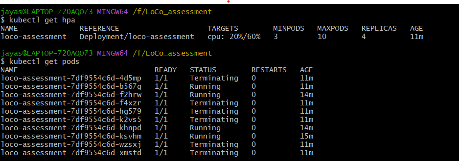
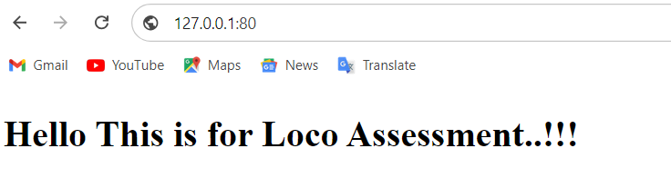

# loco-assessment
loco-assessment

Docker image is hosted in public repo 

## docker pull aryanarr/loco_assessment

# Screenshot of HPA autoscaling 

# screenshot of loadbancer accessed via port 80 through browser

# Note: This setup is done and tested using Minikube locally, Minikube tunnel is used to generate the externalIP for LoadBalancer.
